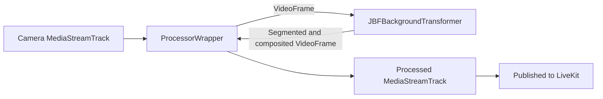

# JBF Video Processor

This package provides `JBFBackgroundProcessor`, a LiveKit video `TrackProcessor` that uses person segmentation plus joint bilateral filter post-processing for cleaner background blur and virtual backgrounds.

## Browser Support

JBF processing requires WebGL2, `OffscreenCanvas`, `VideoFrame`, and either `MediaStreamTrackProcessor`/`MediaStreamTrackGenerator` or the canvas capture fallback used by `ProcessorWrapper`.

```ts
import {
  supportsJBFBackgroundProcessors,
  supportsModernJBFBackgroundProcessors,
} from '@tirth0/livekit-track-processor-jbf';

if (!supportsJBFBackgroundProcessors()) {
  throw new Error('This browser does not support JBF background processors');
}

if (supportsModernJBFBackgroundProcessors()) {
  console.log('This browser supports the modern processor APIs');
}
```

## Basic Usage

```ts
import { createLocalVideoTrack } from 'livekit-client';
import { JBFBackgroundProcessor } from '@tirth0/livekit-track-processor-jbf';

const videoTrack = await createLocalVideoTrack();
const processor = JBFBackgroundProcessor({
  mode: 'background-blur',
  blurRadius: 10,
});

await videoTrack.setProcessor(processor);
room.localParticipant.publishTrack(videoTrack);
```

## Modes

- `JBFBackgroundProcessor({ mode: 'background-blur', blurRadius: 10 })` blurs the background behind the person.
- `JBFBackgroundProcessor({ mode: 'virtual-background', imagePath: '/background.jpg' })` replaces the background with an image.
- `JBFBackgroundProcessor({ mode: 'disabled' })` passes frames through unchanged while keeping the processor attached.

## Switching Modes

Calling `videoTrack.setProcessor()` and `videoTrack.stopProcessor()` for every toggle can create visual artifacts. Initialize once, then switch modes through the processor:

```ts
const processor = JBFBackgroundProcessor({ mode: 'disabled' });
await videoTrack.setProcessor(processor);

await processor.switchTo({ mode: 'background-blur', blurRadius: 12 });
await processor.switchTo({ mode: 'virtual-background', imagePath: '/background.jpg' });
await processor.switchTo({ mode: 'disabled' });
```

## JBF Tuning

JBF tuning options can be provided directly to `JBFBackgroundProcessor()` in any mode. Mode-specific fields such as `blurRadius` and `imagePath` control the active background effect, while the shared JBF options control mask refinement, temporal smoothing, compositing, debugging, and MediaPipe asset loading.

```ts
const processor = JBFBackgroundProcessor({
  mode: 'background-blur',
  blurRadius: 10,
  coverage: [0.68, 0.83],
  jointBilateralFilterEnabled: true,
  sigmaSpace: 1,
  sigmaColor: 0.1,
  temporalMode: 'temporal',
  temporalAlpha: 0.5,
  maskFeatheringEnabled: true,
  maskFeatheringStrength: 0.35,
});
```

Use `updateTransformerOptions()` to change JBF tuning while the processor is attached. This is useful for tuning quality or performance from UI controls without calling `videoTrack.setProcessor()` again.

```ts
await processor.updateTransformerOptions({
  jointBilateralFilterEnabled: true,
  temporalMode: 'hysteresis',
  hysteresisEnterThreshold: 0.45,
  hysteresisExitThreshold: 0.25,
  debugOutput: 'none',
});
```

Use `switchTo()` for changing processor modes, and `updateTransformerOptions()` for changing JBF tuning. For example, switch to a virtual background and then adjust the shared mask settings:

```ts
await processor.switchTo({ mode: 'virtual-background', imagePath: '/background.jpg' });
await processor.updateTransformerOptions({
  coverage: [0.7, 0.86],
  maskFeatheringStrength: 0.4,
});
```

### Processor Options

Mode-specific options:

- `mode`: required. Accepts `background-blur`, `virtual-background`, or `disabled`. Selects the processor behavior.
- `blurRadius`: default `10` for `background-blur`. Controls the blur radius applied to the background.
- `imagePath`: required for `virtual-background`; no default. URL or path for the replacement background image.

Shared JBF options:

- `coverage`: default `[0.68, 0.83]`. Confidence-mask range used when compositing the foreground over the processed background.
- `lightWrapping`: default `0.3`. Adds background color around foreground edges in virtual-background mode to reduce hard cutouts.
- `blendMode`: default `screen`. Accepts `screen` or `linearDodge`; controls how light wrapping is blended into the foreground.
- `jointBilateralFilterEnabled`: default `true`. Enables edge-aware mask refinement using the source frame as guidance.
- `sigmaSpace`: default `1`. Controls the spatial radius of the joint bilateral filter.
- `sigmaColor`: default `0.1`. Controls how strongly source-frame color differences preserve edges during JBF refinement.
- `dilationEnabled`: default `false`. Expands the mask before filtering, which can help cover edge gaps around the person.
- `dilationStrength`: default `0.7`. Controls how strongly mask dilation expands foreground coverage when dilation is enabled.
- `temporalMode`: default `temporal`. Accepts `off`, `temporal`, or `hysteresis`; controls frame-to-frame mask smoothing.
- `temporalAlpha`: default `0.5`. Smoothing factor for `temporal` mode; higher values react faster to new masks.
- `hysteresisEnterThreshold`: default `0.45`. Foreground threshold for entering the mask in `hysteresis` mode.
- `hysteresisExitThreshold`: default `0.25`. Background threshold for leaving the mask in `hysteresis` mode.
- `maskFeatheringEnabled`: default `true`. Softens mask edges after refinement.
- `maskFeatheringStrength`: default `0.35`. Controls how much feathering is applied when mask feathering is enabled.
- `debugOutput`: default `none`. Accepts `none`, `raw-mask`, `dilated-mask`, `jbf-mask`, `temporal-mask`, or `coverage-mask`; renders intermediate masks for tuning.

MediaPipe, stats, and wrapper options:

- `segmenterOptions`: default `{}`. Extra MediaPipe image segmenter base options; these are merged into the default GPU segmenter configuration.
- `assetPaths.tasksVisionFileSet`: default `https://cdn.jsdelivr.net/npm/@mediapipe/tasks-vision@<installed-version>/wasm`. Override when self-hosting MediaPipe WASM files.
- `assetPaths.modelAssetPath`: default `https://storage.googleapis.com/mediapipe-models/image_segmenter/selfie_segmenter/float16/latest/selfie_segmenter.tflite`. Override when self-hosting the model.
- `onFrameProcessed`: default `undefined`. Callback that receives `processingTimeMs`, `segmentationTimeMs`, and `filterTimeMs` for each processed frame.
- `maxFps`: default `30`. Maximum frame rate used by the canvas `captureStream()` fallback path.

## Custom MediaPipe Assets

By default, the processor loads MediaPipe Tasks Vision WASM from jsDelivr and the selfie segmenter model from Google Cloud Storage. Override those paths when you need to self-host assets:

```ts
const processor = JBFBackgroundProcessor({
  mode: 'background-blur',
  assetPaths: {
    tasksVisionFileSet: '/mediapipe/wasm',
    modelAssetPath: '/models/selfie_segmenter.tflite',
  },
});
```

## Architecture Overview



`ProcessorWrapper` handles the browser track processing plumbing. `JBFBackgroundTransformer` owns segmentation, JBF mask refinement, temporal smoothing, and WebGL compositing.
