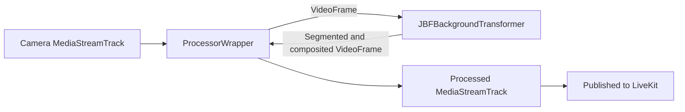

# JBF Video Processor

This package provides `JBFBackgroundProcessor`, a LiveKit video `TrackProcessor` that uses person segmentation plus joint bilateral filter post-processing for cleaner background blur and virtual backgrounds.

## Browser Support

JBF processing requires WebGL2, `OffscreenCanvas`, `VideoFrame`, and either `MediaStreamTrackProcessor`/`MediaStreamTrackGenerator` or the canvas capture fallback used by `ProcessorWrapper`.

```ts
import {
  supportsJBFBackgroundProcessors,
  supportsModernJBFBackgroundProcessors,
} from '@tirth0/livekit-track-processor-jbf';

if (!supportsJBFBackgroundProcessors()) {
  throw new Error('This browser does not support JBF background processors');
}

if (supportsModernJBFBackgroundProcessors()) {
  console.log('This browser supports the modern processor APIs');
}
```

## Basic Usage

```ts
import { createLocalVideoTrack } from 'livekit-client';
import { JBFBackgroundProcessor } from '@tirth0/livekit-track-processor-jbf';

const videoTrack = await createLocalVideoTrack();
const processor = JBFBackgroundProcessor({
  mode: 'background-blur',
  blurRadius: 10,
});

await videoTrack.setProcessor(processor);
room.localParticipant.publishTrack(videoTrack);
```

## Modes

- `JBFBackgroundProcessor({ mode: 'background-blur', blurRadius: 10 })` blurs the background behind the person.
- `JBFBackgroundProcessor({ mode: 'virtual-background', imagePath: '/background.jpg' })` replaces the background with an image.
- `JBFBackgroundProcessor({ mode: 'disabled' })` passes frames through unchanged while keeping the processor attached.

## Switching Modes

Calling `videoTrack.setProcessor()` and `videoTrack.stopProcessor()` for every toggle can create visual artifacts. Initialize once, then switch modes through the processor:

```ts
const processor = JBFBackgroundProcessor({ mode: 'disabled' });
await videoTrack.setProcessor(processor);

await processor.switchTo({ mode: 'background-blur', blurRadius: 12 });
await processor.switchTo({ mode: 'virtual-background', imagePath: '/background.jpg' });
await processor.switchTo({ mode: 'disabled' });
```

## JBF Tuning

The processor accepts post-processing options in any mode. These can also be changed later with `updateTransformerOptions()`.

```ts
const processor = JBFBackgroundProcessor({
  mode: 'background-blur',
  blurRadius: 10,
  coverage: [0.68, 0.83],
  jointBilateralFilterEnabled: true,
  sigmaSpace: 1,
  sigmaColor: 0.1,
  temporalMode: 'temporal',
  temporalAlpha: 0.5,
  maskFeatheringEnabled: true,
  maskFeatheringStrength: 0.35,
});

await processor.updateTransformerOptions({
  temporalMode: 'hysteresis',
  hysteresisEnterThreshold: 0.45,
  hysteresisExitThreshold: 0.25,
});
```

Useful options:

- `coverage` controls the mask range used when compositing the person over the processed background.
- `jointBilateralFilterEnabled`, `sigmaSpace`, and `sigmaColor` control edge-aware mask refinement.
- `dilationEnabled` and `dilationStrength` can expand the mask before filtering.
- `temporalMode`, `temporalAlpha`, `hysteresisEnterThreshold`, and `hysteresisExitThreshold` reduce mask flicker over time.
- `maskFeatheringEnabled` and `maskFeatheringStrength` soften mask edges.
- `debugOutput` can render intermediate masks for tuning.

## Custom MediaPipe Assets

By default, the processor loads MediaPipe Tasks Vision WASM from jsDelivr and the selfie segmenter model from Google Cloud Storage. Override those paths when you need to self-host assets:

```ts
const processor = JBFBackgroundProcessor({
  mode: 'background-blur',
  assetPaths: {
    tasksVisionFileSet: '/mediapipe/wasm',
    modelAssetPath: '/models/selfie_segmenter.tflite',
  },
});
```

## Architecture Overview



`ProcessorWrapper` handles the browser track processing plumbing. `JBFBackgroundTransformer` owns segmentation, JBF mask refinement, temporal smoothing, and WebGL compositing.
